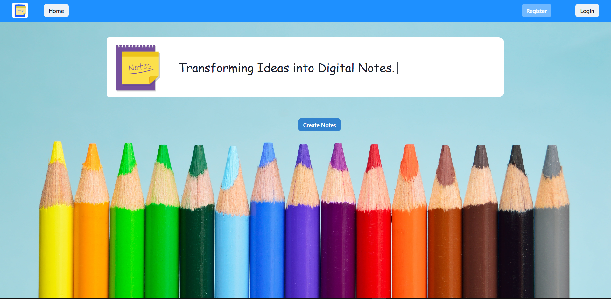
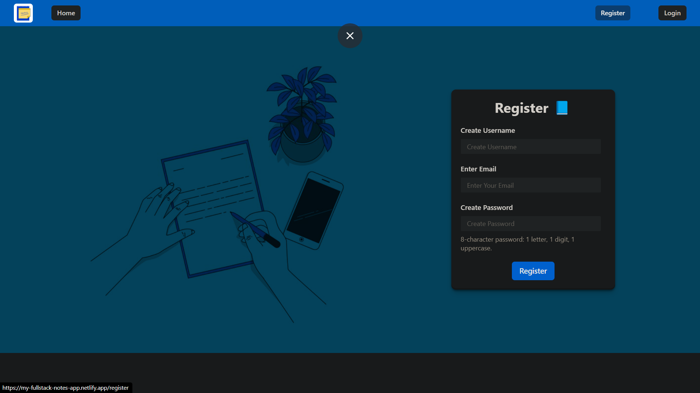
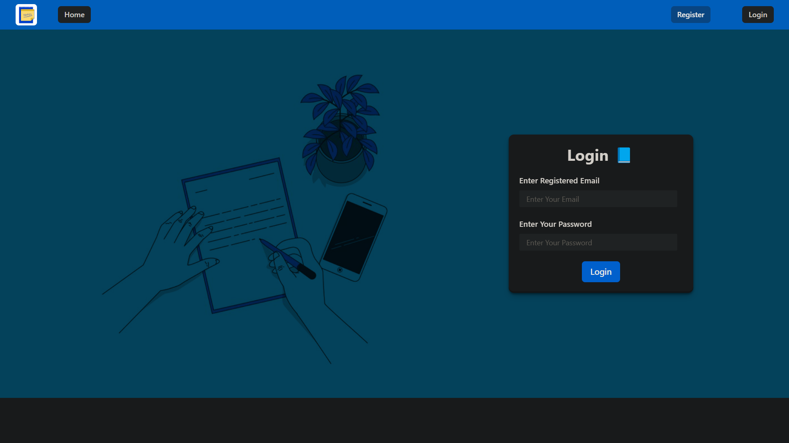
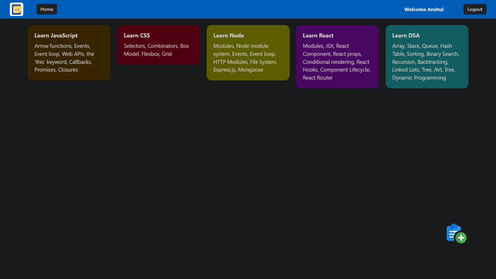

# Notes-App

The Keep My-Notes App simplifies the task of creating and managing personalized notes, offering a user-friendly interface for efficient note-taking.

## Features
- Login
- Signup
- Add Note
- Edit Note
- Delete Note
- Logout

## Preview

- Homepage

- Register

- Login

- Create Note

- Notes

------------------------------------------------------------------------------------------

